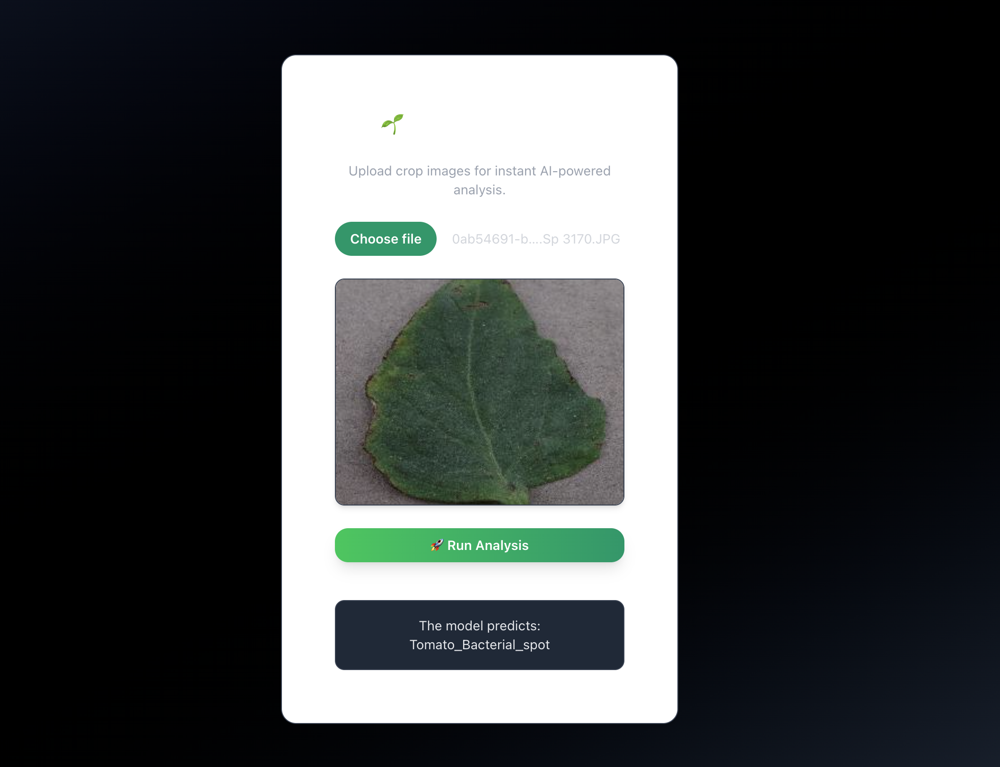

# AgriRakshak
# 🌱 AgriRakshak: AI-based Crop Pest & Disease Detection



## 📖 Description  
**AgriRakshak** is an AI-powered mobile + web solution designed to help farmers detect **crop pests and diseases in real-time** using machine learning.  
By simply capturing an image of a crop, farmers receive instant diagnosis.  

🚜 Our mission: *Empower farmers with affordable, accessible technology to improve yield and reduce losses.*  

> **🔄 Recent Update**: The frontend has been migrated from Next.js to React + Vite and converted from TypeScript to JavaScript for better performance and easier development experience. **No TypeScript knowledge required!**

---

## ✨ Features  
- 📷 **Image-based Detection**: Upload crop images to identify pests/diseases.  
- 🔍 **Accurate ML Models**: Trained on agricultural datasets (90%+ accuracy).  
- 📊 **Data Insights**: Store and visualize disease trends.  
- 🌐 **Farmer-Friendly Interface**: Simple, intuitive UI.  
- ⚡ **Lightweight & Fast**: Runs on low-end devices and web browsers.
- 🚀 **Beginner-Friendly**: Written in JavaScript (no TypeScript required!)
- 🎨 **Modern UI**: Beautiful design with Tailwind CSS and Radix UI components.  

---

## 🛠️ Tech Stack  
- **Frontend**: React 18 + Vite + JavaScript
- **Backend**: Flask (Python)  
- **ML Framework**: PyTorch  
- **UI Components**: Radix UI + Tailwind CSS
- **Deployment**: Render.com (Backend) + Vercel (Frontend)  

---

## 📥 Installation  

### Backend Setup
1. **Clone the repo**  
   ```bash
   git clone https://github.com/<your-username>/AgriRakshak.git
   cd AgriRakshak/backend
   ```

2. **Install Python dependencies**
   ```bash
   pip install -r requirements.txt
   ```

3. **Run the Flask backend**
   ```bash
   python api.py
   ```
   Backend will be available at `http://localhost:5000`

### Frontend Setup
1. **Navigate to frontend directory**
   ```bash
   cd ../frontend
   ```

2. **Install Node.js dependencies**
   ```bash
   npm install
   ```

3. **Start the React development server**
   ```bash
   npm run dev
   ```
   Frontend will be available at `http://localhost:5173`

### Quick Start (Both Services)
```bash
# Terminal 1 - Backend
cd backend && python api.py

# Terminal 2 - Frontend  
cd frontend && npm run dev
```

---

## 🚀 Usage 

### Web Application
1. **Open the application** in your browser at `http://localhost:5173`
2. **Click "Run Analysis"** to test the connection with the backend
3. **Upload crop images** (when image upload feature is implemented)
4. **Get instant diagnosis** of crop diseases and pests

### Supported Crops & Diseases
- **Pepper**: Bacterial spot, Healthy
- **Potato**: Early blight, Late blight, Healthy  
- **Tomato**: Bacterial spot, Early blight, Late blight, Leaf Mold, Septoria leaf spot, Spider mites, Target Spot, Yellow Leaf Curl Virus, Mosaic virus, Healthy

### Model Performance
- **Training Accuracy**: 94%
- **Test Accuracy**: 90.41%
- **Model Size**: Lightweight CNN optimized for web deployment

---

## 📁 Project Structure
```
AgriRakshak/
├── backend/
│   ├── api.py                 # Flask REST API
│   ├── app.py                 # Streamlit ML interface
│   ├── model.ipynb           # Model training notebook
│   ├── crop_disease_model.pth # Trained PyTorch model
│   └── requirements.txt      # Python dependencies
├── frontend/
│   ├── src/
│   │   ├── components/ui/     # Reusable UI components
│   │   ├── lib/              # Utility functions
│   │   ├── App.jsx           # Main React component
│   │   └── main.jsx          # Application entry point
│   ├── package.json          # Node.js dependencies
│   └── vite.config.js        # Vite configuration
├── dataset/                  # Training images (15 disease classes)
└── README.md
```

## 🛠️ Development

### Frontend Development
```bash
cd frontend
npm run dev          # Start development server
npm run build        # Build for production
npm run preview      # Preview production build
npm run lint         # Run ESLint
```

### Backend Development
```bash
cd backend
python api.py        # Start Flask API server
python app.py        # Start Streamlit ML interface
```

### Model Training
The model can be retrained using the Jupyter notebook:
```bash
cd backend
jupyter notebook model.ipynb
```

---
## 🔧 Troubleshooting

### Common Issues

**Frontend not connecting to backend:**
- Ensure the Flask backend is running on `http://localhost:5000`
- Check that CORS is enabled in the Flask app
- Verify the API endpoint URL in the frontend code

**Module not found errors:**
- Run `npm install` in the frontend directory
- Run `pip install -r requirements.txt` in the backend directory

**Port already in use:**
- Frontend: Change port in `vite.config.ts` or use `npm run dev -- --port 3000`
- Backend: Change port in `api.py` or use `python api.py --port 5001`

**Model loading issues:**
- Ensure `crop_disease_model.pth` exists in the backend directory
- Check PyTorch installation and version compatibility

---

## Contact
- If you have any suggestions drop me a mail at `kavinmoudgil.work@gmail.com`
